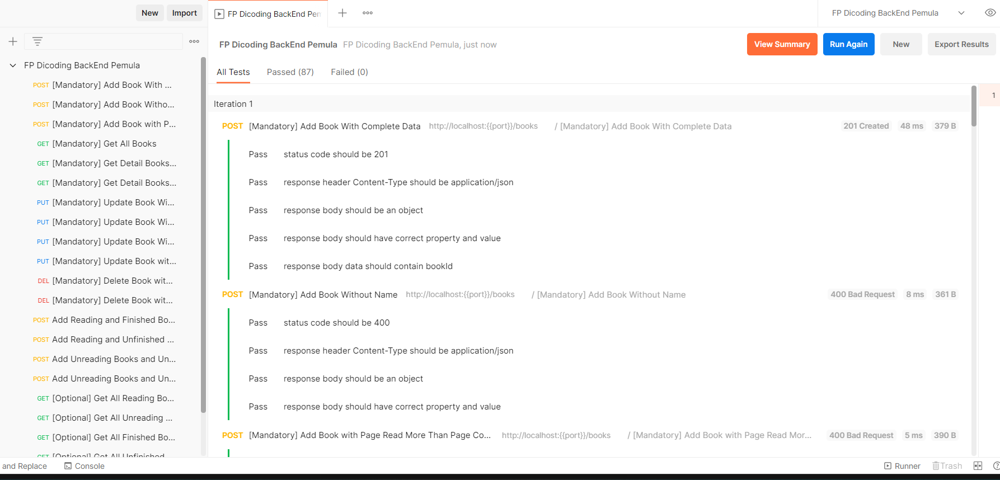

# DicodingBackend
## Pemula
### Study about :
1. Node JS basic
2. Build web service using Native NodeJS
3. Build web service using Hapi framework
4. Deploy web service in Amazon EC2
5. Basic Postman
6. Automatic testing in Postman

## Fundamental
